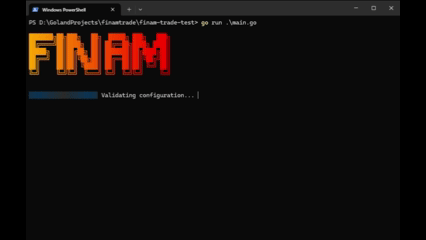

<div align="center">

[](https://github.com/updevru/finam-terminal/actions/workflows/ci.yml)
[](https://goreportcard.com/report/github.com/updevru/finam-terminal)
[](https://opensource.org/licenses/Apache-2.0)
[](https://github.com/updevru/finam-terminal/releases)
[](https://github.com/updevru/finam-terminal)

<h1>Finam Terminal</h1>

Finam Terminal — это терминальный интерфейс (TUI) для торговли и просмотра рыночных данных через API брокера Финам. Приложение написано на Go и работает прямо в консоли.



</div>

## Установка

### Готовые бинарные файлы
Вы можете скачать скомпилированные файлы для вашей операционной системы со страницы [Releases](https://github.com/updevru/finam-terminal/releases):
- **Windows** (amd64)
- **Linux** (amd64)
- **macOS** (Intel & Apple Silicon)

Просто скачайте файл, переименуйте его в `finam-terminal` (если нужно) и запустите в терминале.

### С помощью Docker
Приложение доступно в GitHub Container Registry:

```bash
docker pull ghcr.io/updevru/finam-terminal:latest
docker run -it --rm ghcr.io/updevru/finam-terminal:latest
```

### Сборка из исходного кода
Требуется Go 1.24+.

```bash
# Установка зависимостей
go mod tidy

# Сборка исполняемого файла
go build -o finam-terminal.exe main.go

# Запуск
./finam-terminal.exe
```


## Настройка и получение доступа

Для работы с терминалом вам понадобятся:
1. **Брокерский счет** (или демо-счет).
2. **API Токен**.

Полезные ссылки:
- 🏦 **Открыть брокерский счет:** [finam.ru/landings/otkrytie-scheta/](https://finam.ru/landings/otkrytie-scheta/)
- 🎮 **Открыть демо-счет:** [tradeapi.finam.ru/docs/tokens/](https://tradeapi.finam.ru/docs/tokens/)
- 🔑 **Создать токен:** [tradeapi.finam.ru/docs/tokens/](https://tradeapi.finam.ru/docs/tokens/)

Вставьте полученный токен в экран настройки приложения, и он будет сохранен локально (в `~/.finam-cli/.env`).

## Возможности

- 🚀 Автоматическая начальная настройка.
- 📊 Просмотр портфеля и списка счетов.
- 📈 Отображение котировок в реальном времени.
- 📝 Возможность совершать сделки.

## Для разработчиков

### Структура проекта

- `main.go` — Точка входа.
- `api/` — Клиент для взаимодействия с Finam Trade API (gRPC).
- `ui/` — Компоненты интерфейса (TUI на базе `tview`).
- `config/` — Управление конфигурацией.
- `models/` — Общие структуры данных.
- `conductor/` — Документация и планы разработки (Conductor Framework).

### Переменные окружения

Конфигурация хранится в файле `.env` (в папке проекта или в домашней директории пользователя `~/.finam-cli/.env`).

| Переменная | Описание | Значение по умолчанию |
|------------|----------|-----------------------|
| `FINAM_API_TOKEN` | Токен доступа к API | — |
| `FINAM_GRPC_ADDR` | Адрес gRPC сервера | `api.finam.ru:443` |

### Тестирование

Запуск всех тестов:
```bash
go test ./...
```

Проверка покрытия кода:
```bash
go test -coverprofile=coverage.out ./...
go tool cover -func=coverage.out
```

### Разработка с Gemini и Conductor

Этот проект использует **Gemini CLI** и расширение [**Conductor**](https://github.com/gemini-cli-extensions/conductor) для планирования и реализации задач.

- **Conductor** — это фреймворк для управления состоянием проекта и планирования треков (задач) в папке `conductor/`.
- Все крупные изменения должны сопровождаться обновлением соответствующих спецификаций (`spec.md`) и планов (`plan.md`).

**Основные команды для работы:**

*   **Создание и описание задачи:**
    ```bash
    /conductor:newTrack "Описание задачи"
    ```
*   **Реализация созданной задачи:**
    ```bash
    /conductor:implement
    ```
