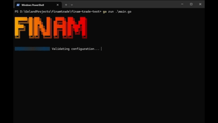

<div align="center">

[](https://github.com/updevru/finam-terminal/actions/workflows/ci.yml)
[](https://goreportcard.com/report/github.com/updevru/finam-terminal)
[](https://opensource.org/licenses/Apache-2.0)
[](https://github.com/updevru/finam-terminal/releases)
[](https://github.com/updevru/finam-terminal)

<h1>Finam Terminal</h1>

Finam Terminal — это терминальный интерфейс (TUI) для торговли и просмотра рыночных данных через API брокера Финам. Приложение написано на Go и работает прямо в консоли.



</div>

> 📖 **Руководство пользователя:** [docs/user_manual/index.md](docs/user_manual/index.md)

## Установка

### Готовые бинарные файлы
Вы можете скачать скомпилированные файлы для вашей операционной системы со страницы [Releases](https://github.com/updevru/finam-terminal/releases):
- **Windows** (amd64)
- **Linux** (amd64)
- **macOS** (Intel & Apple Silicon)

Просто скачайте файл, переименуйте его в `finam-terminal` (если нужно) и запустите в терминале.

### С помощью Docker
Приложение доступно в GitHub Container Registry:

```bash
docker pull ghcr.io/updevru/finam-terminal:latest
docker run -it --rm ghcr.io/updevru/finam-terminal:latest
```

### Сборка из исходного кода
Требуется Go 1.26+.

```bash
# Установка зависимостей
go mod tidy

# Рекомендуемая сборка: версия и метаданные подставляются через -ldflags
# (git tag, commit SHA, дата сборки попадут в заголовок терминала)
make build
./finam-terminal

# Альтернативный вариант — собрать «как есть».
# Версия будет показана как dev (<short-sha>) благодаря runtime/debug.ReadBuildInfo.
go build -o finam-terminal.exe main.go
./finam-terminal.exe
```


## Обновление

Релизная сборка сама проверяет наличие новых версий — раз в сутки, в фоне, не замедляя ни запуск, ни работу. Когда выходит новая версия, при следующем запуске появляется диалог «Обновить и перезапустить / Продолжить». Во время работы терминал об обновлениях не напоминает; то же окно можно открыть клавишей `U` в любой момент.

При обновлении терминал скачивает ассет релиза для вашей ОС, сверяет SHA256 с `checksums.txt` из релиза, атомарно заменяет собственный файл и перезапускается. Любая ошибка не прерывает работу: текущая версия остаётся целой. Результат проверки кэшируется в `~/.finam-cli/update.json` рядом с токеном.

Обновиться можно и вручную:

```bash
curl -fsSL https://fcli.ru/install.sh | bash
```

```powershell
irm https://fcli.ru/install.ps1 | iex
```

> В dev-сборке (`go run`, `go build`, Docker-образ) версия отображается как `dev`, и механизм молчит целиком: ни запросов в сеть, ни файла состояния, ни диалога. Образ Docker обновляется через `docker pull`.

## Настройка и получение доступа

Для работы с терминалом вам понадобятся:
1. **Брокерский счет** (или демо-счет).
2. **API Токен**.

Полезные ссылки:
- 🏦 **Открыть брокерский счет:** [finam.ru/landings/otkrytie-scheta/](https://finam.ru/landings/otkrytie-scheta/)
- 🎮 **Открыть демо-счет:** [tradeapi.finam.ru/docs/tokens/](https://tradeapi.finam.ru/docs/tokens/)
- 🔑 **Создать токен:** [api.finam.ru/tokens/](https://api.finam.ru/tokens/)

Новые токены выдаются в коротком формате `tapi_sk_...`. Старые длинные токены помечены как Legacy, но продолжают работать.

Вставьте полученный токен в экран настройки приложения, и он будет сохранен локально (в `~/.finam-cli/.env`).

## Возможности

- 🚀 Автоматическая начальная настройка.
- 📊 Просмотр портфеля, истории и заявок по всем счетам.
- 🔍 Поиск инструментов по тикеру или названию.
- 📈 Котировки в реальном времени по потоку `SubscribeQuote`: цены активного счёта и открытого профиля обновляются по мере поступления сделок, а при обрыве стрима терминал автоматически возвращается к опросу раз в 5 секунд.
- 📋 Детальный профиль инструмента с графиком свечей: для фьючерсов, опционов и облигаций отображаются специфичные поля (экспирация, размер контракта, страйк, номинал) и open interest.
- 🗓️ Календари корпоративных действий в профиле: дивиденды и сплиты по акциям, купоны, амортизация и оферты по облигациям.
- 📝 Размещение заявок: Market, Limit, Stop-Loss, Take-Profit, связанные SL/TP пары. Объём считается по торговому лоту (`trade_lot_size`) — тому же, что показан в модалке и в профиле инструмента.
- ✏️ Управление заявками: отмена (X/Del) и модификация (E) прямо из терминала.
- 🧾 НКД и валюта в истории сделок по облигациям и маркер `↳` для связи «стоп-заявка → порождённая биржевая заявка».
- ⚡ Автообновление: фоновая проверка релизов GitHub раз в сутки, предложение обновиться при запуске и установка новой версии с перезапуском (также по клавише `U`).

## Для разработчиков

### Структура проекта

- `main.go` — Точка входа.
- `api/` — Клиент для взаимодействия с Finam Trade API (gRPC).
- `api/testserver/` — In-process мок-сервер gRPC (на базе `bufconn`) для интеграционных тестов.
- `ui/` — Компоненты интерфейса (TUI на базе `tview`).
- `config/` — Управление конфигурацией.
- `models/` — Общие структуры данных.
- `version/` — Метаданные сборки (`Version`, `Commit`, `BuildDate`), подставляемые через `-ldflags` или восстанавливаемые из `runtime/debug.ReadBuildInfo()`. Используются заголовком TUI.
- `conductor/` — Документация и планы разработки (Conductor Framework).

### Переменные окружения

Конфигурация хранится в файле `.env` (в папке проекта или в домашней директории пользователя `~/.finam-cli/.env`).

| Переменная | Описание | Значение по умолчанию |
|------------|----------|-----------------------|
| `FINAM_API_TOKEN` | Токен доступа к API | — |
| `FINAM_GRPC_ADDR` | Адрес gRPC сервера | `api.finam.ru:443` |

### Тестирование

В проекте два слоя автоматических тестов: **unit-тесты** и **интеграционные тесты**. Интеграционные тесты не требуют сетевого подключения и реального API-токена — они используют in-process мок-сервер gRPC из пакета `api/testserver/` поверх `google.golang.org/grpc/test/bufconn`.

```bash
# Только unit-тесты (без build-тегов)
go test ./...

# Интеграционные тесты против мок-сервера gRPC
go test -tags=integration ./api/...

# Всё вместе
go test ./... && go test -tags=integration ./api/...
```

Готовые цели в `Makefile` упрощают локальный цикл разработки:

```bash
make test              # unit-тесты
make test-integration  # интеграционные тесты
make test-all          # unit + интеграционные
make test-race         # всё с детектором гонок (требует CGO_ENABLED=1)
make coverage          # объединённый отчёт о покрытии (unit + integration)
make lint              # golangci-lint run
```

Линтер можно запускать и напрямую:
```bash
golangci-lint run
```

### Разработка с Conductor

Этот проект использует расширение [**Conductor**](https://github.com/gemini-cli-extensions/conductor) для планирования и реализации задач.

- **Conductor** — это фреймворк для управления состоянием проекта и планирования треков (задач) в папке `conductor/`.
- Все крупные изменения должны сопровождаться обновлением соответствующих спецификаций (`spec.md`) и планов (`plan.md`).

**Основные команды для работы:**

*   **Создание и описание задачи:**
    ```bash
    /conductor:newTrack "Описание задачи"
    ```
*   **Реализация созданной задачи:**
    ```bash
    /conductor:implement
    ```
