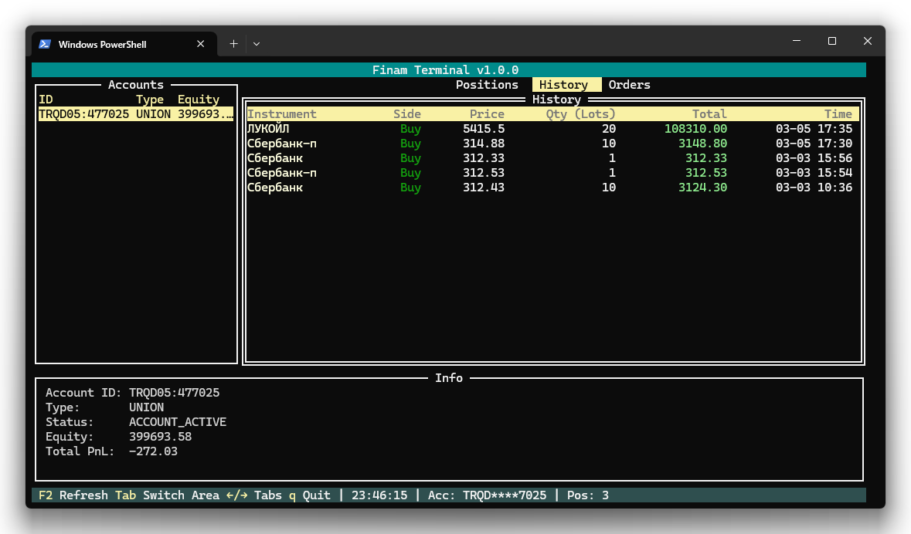

# История сделок

Вкладка «История» отображает журнал всех совершённых сделок по выбранному счёту за последние 30 дней.

## Колонки таблицы

| Колонка | Описание |
|---------|----------|
| **Instrument** | Название инструмента или тикер |
| **Side** | Направление сделки: Buy (покупка) или Sell (продажа) |
| **Price** | Цена исполнения сделки |
| **Qty (Lots)** | Количество в лотах |
| **Total** | Общая сумма сделки (цена × количество) |
| **Time** | Дата и время совершения сделки (формат: ММ-ДД ЧЧ:ММ) |

## Цветовая индикация

- **Зелёный** — покупка (Buy)
- **Красный** — продажа (Sell)

## Навигация

| Клавиша | Действие |
|---------|----------|
| ↑ / ↓ | Навигация по списку сделок |
| ← / → | Переключиться на другую вкладку |
| R | Обновить историю |
| S | Открыть [поиск инструментов](search.md) |

## Примечания

- Отображаются сделки за последние **30 дней**
- Если сделок нет, показывается сообщение «No trade history found»
- История включает все сделки, в том числе совершённые через другие терминалы
- При каждом переключении на эту вкладку данные загружаются заново

---

| [← Позиции](positions.md) | [Далее: Заявки →](orders.md) |
|:---|---:|
