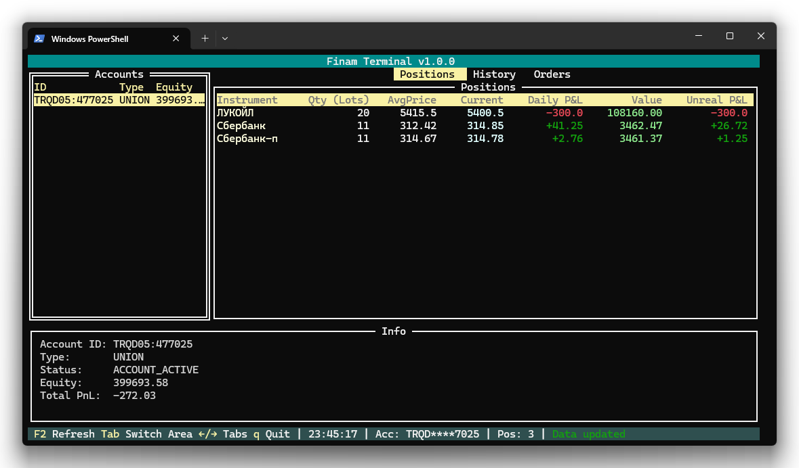

# Обзор интерфейса

Интерфейс Finam Terminal разделён на четыре основные области, которые всегда видны на экране.

## Компоновка экрана

### 1. Список счетов (левая панель)

Вертикальная панель в левой части экрана. Отображает все доступные торговые счета. Для каждого счёта показано:

- **ID счёта** — номер торгового счёта
- **Эквити** — текущая стоимость портфеля на счёте
- **Дневной P&L** — прибыль или убыток за текущий торговый день

Цветовая индикация дневного P&L:
- Зелёный — положительный P&L (прибыль)
- Красный — отрицательный P&L (убыток)
- Серый — нулевой P&L

Выбранный счёт подсвечивается тёмным фоном. Все данные в остальных панелях отображаются для выбранного счёта.

### 2. Основная область (центр)

Занимает большую часть экрана. Содержит три вкладки, между которыми можно переключаться:

- **Позиции** — текущие открытые позиции в портфеле
- **История** — журнал совершённых сделок
- **Заявки** — активные и исполненные ордера

Заголовок активной вкладки выделен цветом. Подробное описание каждой вкладки — в соответствующих разделах руководства.

### 3. Информационная панель (низ)

Располагается под основной таблицей. Показывает сводку по выбранному счёту:

- **Счёт** — замаскированный номер счёта (первые и последние 4 цифры)
- **Тип** — тип торгового счёта
- **Статус** — текущий статус счёта
- **Эквити** — стоимость портфеля
- **Общий P&L** — суммарный нереализованный P&L по всем позициям

Если счёт недоступен (ошибка загрузки со стороны брокера), панель отображает сообщение об ошибке красным цветом.

### 4. Статус-бар (самый низ)

Однострочная панель в самом низу экрана:

- **Подсказки** — доступные горячие клавиши для текущего контекста
- **Время** — текущее время (обновляется каждую секунду)
- **Счёт** — номер активного счёта
- **Позиции** — количество открытых позиций
- **Статус** — последнее системное сообщение (жёлтый — загрузка, зелёный — успех, красный — ошибка)

## Навигация

### Переключение счетов

Когда фокус на списке счетов:

| Клавиша | Действие |
|---------|----------|
| ↑ | Предыдущий счёт |
| ↓ | Следующий счёт |

При переключении счёта все данные (позиции, история, заявки) обновляются автоматически.

### Переключение фокуса

| Клавиша | Действие |
|---------|----------|
| Tab | Переключить фокус между списком счетов и основной таблицей |
| Shift+Tab | Переключить фокус в обратном направлении |

### Переключение вкладок

Когда фокус на основной таблице:

| Клавиша | Действие |
|---------|----------|
| ← | Предыдущая вкладка |
| → | Следующая вкладка |

Вкладки переключаются циклически: после «Заявки» — снова «Позиции».

### Общие клавиши

| Клавиша | Действие |
|---------|----------|
| S | Открыть поиск инструментов |
| R | Обновить данные текущей вкладки |
| Q | Выйти из приложения |
| F1 | Вернуться к списку счетов |
| F2 | Обновить данные |

> **Примечание**: горячие клавиши работают и при включённой русской раскладке клавиатуры (например, Ы вместо S, К вместо R, Й вместо Q).

## Автоматическое обновление

Данные обновляются автоматически каждые 5 секунд в фоне. Приоритет отдаётся активному счёту — его данные обновляются первыми, затем остальные счета.

---

| [← Содержание](index.md) | [Далее: Позиции →](positions.md) |
|:---|---:|
