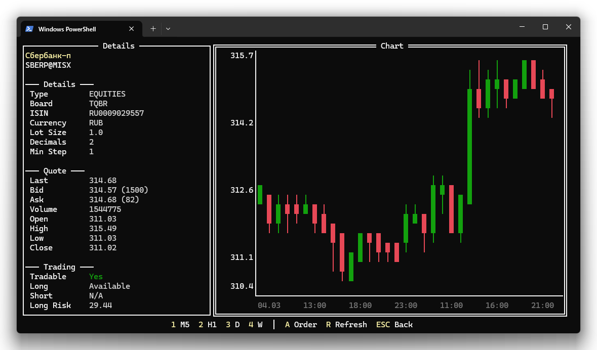

# Профиль инструмента

Профиль — это полноэкранное окно с подробной информацией об инструменте: характеристики бумаги, текущие котировки, торговые параметры, расписание сессий и свечной график.

## Как открыть

- **Enter** на выбранной позиции во вкладке «Позиции»
- **P** на выбранном инструменте в окне [поиска](search.md)

## Левая панель — информация

### Детали инструмента

| Поле | Описание |
|------|----------|
| **Type** | Тип инструмента (акция, облигация, фьючерс и др.) |
| **Board** | Торговая площадка / режим торгов |
| **ISIN** | Международный идентификационный код |
| **Currency** | Валюта котирования |
| **Lot Size** | Размер лота (количество бумаг в одном лоте) |
| **Decimals** | Количество знаков после запятой в цене |
| **Min Step** | Минимальный шаг цены |
| **Expiry** | Дата экспирации (для фьючерсов и опционов) |

### Котировки

| Поле | Описание |
|------|----------|
| **Last** | Цена последней сделки |
| **Bid** | Лучшая цена покупки (с указанием объёма) |
| **Ask** | Лучшая цена продажи (с указанием объёма) |
| **Volume** | Объём торгов за сессию |
| **Open** | Цена открытия |
| **High** | Максимальная цена за сессию |
| **Low** | Минимальная цена за сессию |
| **Close** | Цена закрытия предыдущей сессии |

### Торговые параметры

| Поле | Описание |
|------|----------|
| **Tradable** | Доступен ли инструмент для торговли (Yes / No) |
| **Longable** | Можно ли открывать длинные позиции |
| **Shortable** | Можно ли открывать короткие позиции |
| **Risk rates** | Риск-ставки для лонга и шорта |
| **Margin** | Начальная маржа для лонга и шорта |

### Расписание торговых сессий

Список торговых сессий с указанием времени начала и окончания. Типы сессий: основная, утренняя, вечерняя, аукцион открытия, аукцион закрытия и другие.

## Правая панель — свечной график

График отображает ценовую динамику инструмента в виде японских свечей:

- **Зелёные свечи** — рост (цена закрытия выше цены открытия)
- **Красные свечи** — падение (цена закрытия ниже цены открытия)
- **Тело свечи** — диапазон между ценами открытия и закрытия
- **Тени (фитили)** — максимум и минимум за период

По оси Y отображается цена, по оси X — время.

### Таймфреймы

Переключение между таймфреймами — клавишами **1–4**:

| Клавиша | Таймфрейм | Период данных | Формат времени на оси X |
|---------|-----------|---------------|------------------------|
| **1** | M5 (5 минут) | 7 дней | ЧЧ:ММ |
| **2** | H1 (1 час) | 30 дней | ЧЧ:ММ |
| **3** | D (день) | 1 год | ДД.ММ |
| **4** | W (неделя) | 5 лет | ДД.ММ.ГГ |

## Действия

| Клавиша | Действие |
|---------|----------|
| 1–4 | Переключить таймфрейм графика |
| A | Создать [заявку](trading.md#создание-заявки) по этому инструменту |
| R | Обновить данные профиля и график |
| S | Открыть [поиск инструментов](search.md) |
| Esc | Закрыть профиль и вернуться к основному экрану |

---

| [← Поиск инструментов](search.md) | [Далее: Торговые операции →](trading.md) |
|:---|---:|
