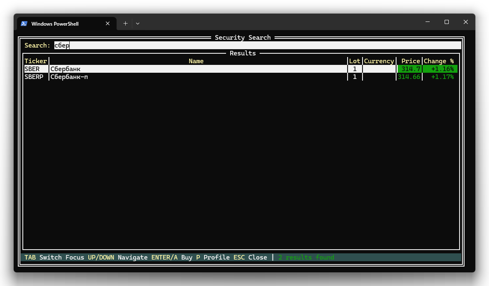

# Поиск инструментов

Окно поиска позволяет найти любой доступный инструмент (акции, облигации, фьючерсы и др.) по тикеру или названию и быстро перейти к созданию заявки или просмотру профиля.

## Как открыть

Нажмите **S** из любого экрана приложения. Поиск открывается поверх основного интерфейса в виде полноэкранного окна.

## Поле ввода

- Начните вводить тикер или часть названия инструмента
- Поиск запускается автоматически после ввода **минимум 3 символов**
- Между нажатиями клавиш есть небольшая задержка (300 мс) — это нормально, запрос отправляется после паузы в вводе

## Результаты поиска

| Колонка | Описание |
|---------|----------|
| **Ticker** | Тикер инструмента (например, SBER, GAZP) |
| **Name** | Полное название инструмента |
| **Lot** | Размер лота |
| **Currency** | Валюта котирования |
| **Price** | Текущая цена (зелёный цвет). Загружается после появления результатов |
| **Change %** | Изменение цены в процентах от предыдущего закрытия. Зелёный — рост, красный — падение |

Цены в результатах поиска **обновляются автоматически каждые 5 секунд**, пока окно поиска открыто.

## Навигация

| Клавиша | Действие |
|---------|----------|
| Tab | Переключить фокус между полем ввода и таблицей результатов |
| ↑ / ↓ | Навигация по результатам (когда фокус на таблице) |
| Enter или A | Создать [заявку](trading.md#создание-заявки) по выбранному инструменту |
| P | Открыть [профиль](profile.md) выбранного инструмента |
| Esc | Закрыть окно поиска и вернуться к основному экрану |

## Типичный сценарий

1. Нажмите **S** для открытия поиска
2. Введите тикер или часть названия, например «газпром» или «GAZP»
3. Дождитесь появления результатов
4. Стрелками ↑/↓ выберите нужный инструмент
5. Нажмите **Enter** или **A** для создания заявки, или **P** для просмотра профиля

---

| [← Заявки](orders.md) | [Далее: Профиль инструмента →](profile.md) |
|:---|---:|
