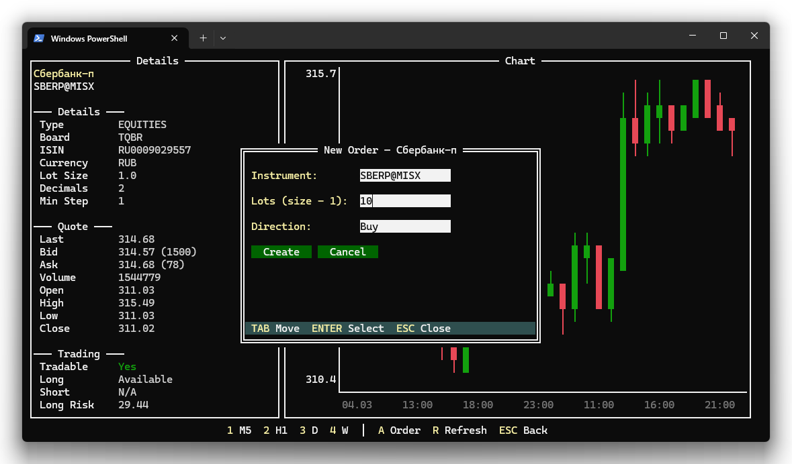
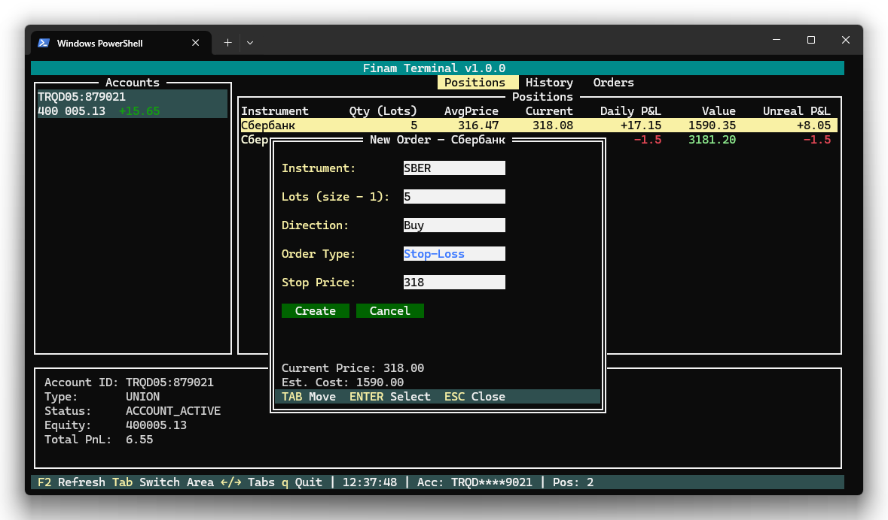
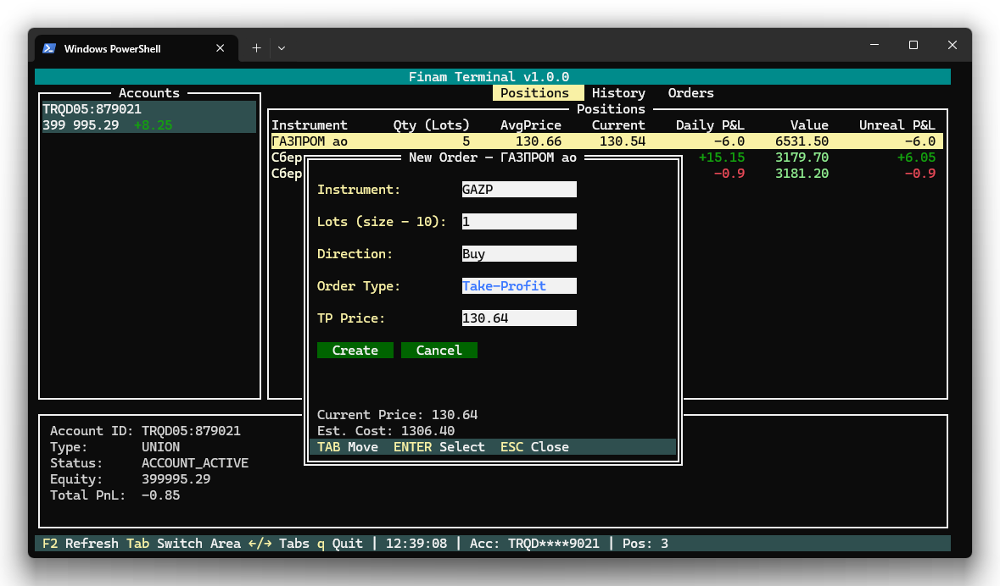
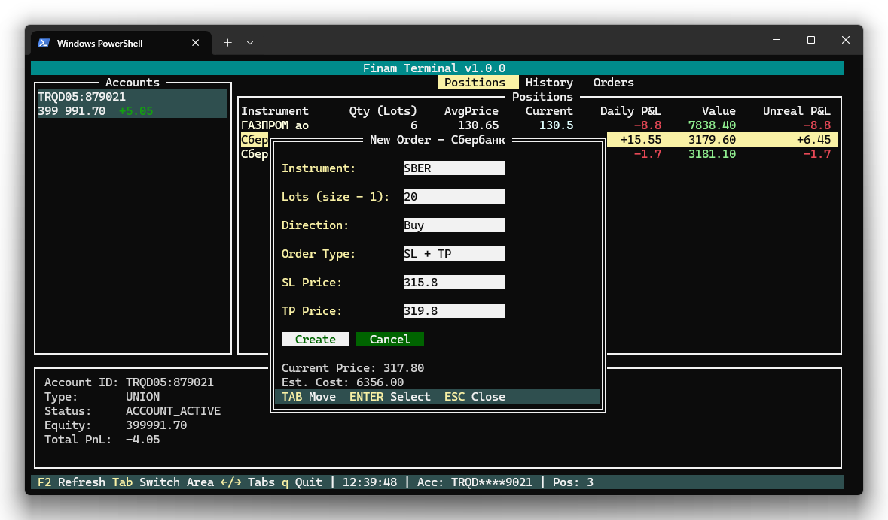
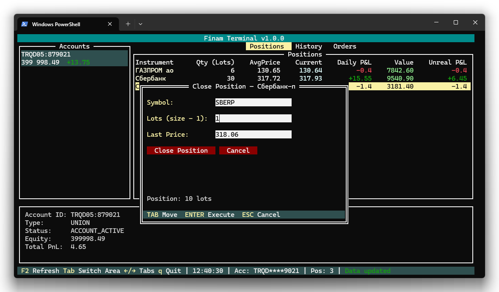
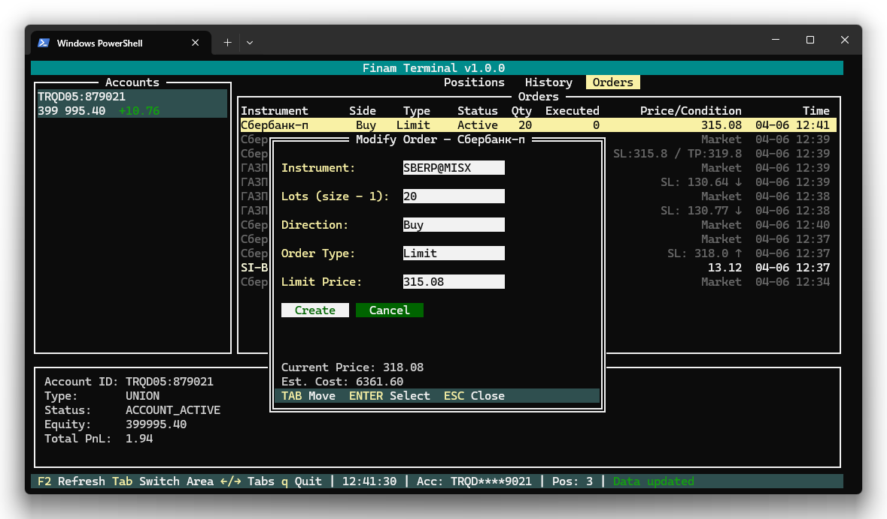
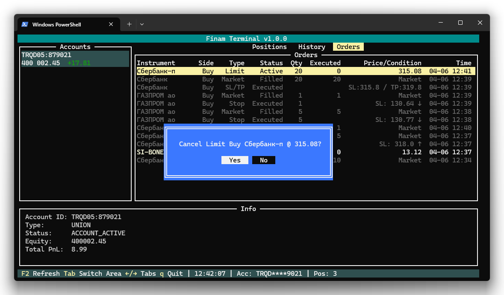

# Торговые операции

В этом разделе описаны все операции, связанные с заявками: создание, закрытие позиции, редактирование и отмена.

## Создание заявки

### Как открыть

- **A** — из вкладки [«Позиции»](positions.md) (инструмент берётся из выбранной позиции)
- **A** — из [профиля инструмента](profile.md)
- **Enter** или **A** — из [окна поиска](search.md) (инструмент берётся из выбранного результата)

### Поля формы

| Поле | Описание |
|------|----------|
| **Instrument** | Тикер инструмента (предзаполняется автоматически) |
| **Quantity** | Количество в лотах |
| **Direction** | Направление: Buy (покупка) или Sell (продажа) |
| **Order Type** | Тип заявки (см. ниже) |

Перемещение между полями — клавиша **Tab** (вперёд) и **Shift+Tab** (назад).

### Информационная область

Под полями формы отображается справочная информация:

- **Current Price** — текущая рыночная цена инструмента
- **Est. Cost** — расчётная стоимость заявки (количество лотов × размер лота × цена)
- **Lot Size** — размер лота отображается в подписи к полю количества

### Типы заявок

При выборе типа заявки в форме автоматически появляются или скрываются дополнительные поля для ввода цен.

#### Market (рыночная)

Заявка исполняется немедленно по лучшей доступной цене на рынке. Дополнительных полей нет.

Используйте, когда важна скорость исполнения, а не точная цена.

#### Limit (лимитная)

Заявка исполняется по указанной цене или лучше. Если рыночная цена не достигла лимита — заявка остаётся активной и ждёт.

| Дополнительное поле | Описание |
|---------------------|----------|
| **Limit Price** | Желаемая цена исполнения |

#### Stop-Loss (стоп-заявка)

Заявка срабатывает, когда рыночная цена достигает указанного уровня. Используется для ограничения убытков.

| Дополнительное поле | Описание |
|---------------------|----------|
| **Stop Price** | Цена срабатывания стоп-заявки |

Направление срабатывания определяется автоматически:
- Для продажи (Sell) — срабатывает при падении цены ниже стоп-уровня
- Для покупки (Buy) — срабатывает при росте цены выше стоп-уровня

#### Take-Profit (тейк-профит)

Заявка срабатывает при достижении целевой цены. Используется для фиксации прибыли.

| Дополнительное поле | Описание |
|---------------------|----------|
| **TP Price** | Целевая цена для фиксации прибыли |

#### SL+TP (стоп-лосс + тейк-профит)

Связанная пара заявок: при исполнении одной вторая автоматически отменяется (OCO — One Cancels Other). Позволяет одновременно защитить позицию от убытков и зафиксировать прибыль.

| Дополнительное поле | Описание |
|---------------------|----------|
| **SL Price** | Цена стоп-лосса |
| **TP Price** | Цена тейк-профита |

Можно заполнить только одну из цен — например, только SL или только TP. Обязательно указать хотя бы одну.

Заявки SL+TP действуют бессрочно (GTC — Good Till Cancel).

### Кнопки

- **Create** — отправить заявку. Кнопка активна только когда все обязательные поля заполнены корректно
- **Cancel** — закрыть окно без отправки

### Валидация

- Поле **Instrument** не может быть пустым
- **Quantity** должен быть больше 0
- Цены (Limit Price, Stop Price, TP Price, SL Price) должны быть больше 0
- Для типа SL+TP — хотя бы одна из цен (SL или TP) должна быть указана

При невалидных данных кнопка «Create» неактивна.

---

## Закрытие позиции

Быстрый способ закрыть открытую позицию.

### Как открыть

Нажмите **C** на выбранной позиции во вкладке [«Позиции»](positions.md).

### Особенности

- **Направление** выставляется автоматически: Sell для длинной позиции, Buy для короткой
- **Количество** предзаполнено текущим объёмом позиции
- Можно изменить количество, чтобы закрыть позицию частично
- Тип заявки по умолчанию — Market (рыночная)

---

## Редактирование заявки

Позволяет изменить параметры активной заявки.

### Как открыть

Нажмите **E** на выбранной заявке во вкладке [«Заявки»](orders.md).

### Особенности

- Все поля формы предзаполнены текущими параметрами заявки
- Количество автоматически конвертируется из штук в лоты
- Доступно только для заявок со статусом **Active** или **Partial**

### Как это работает

При сохранении изменений:
1. Текущая заявка **отменяется**
2. Создаётся **новая заявка** с обновлёнными параметрами

Это стандартное поведение — биржа не поддерживает прямое редактирование заявок.

---

## Отмена заявки

### Как отменить

Нажмите **Delete** или **X** на выбранной заявке во вкладке [«Заявки»](orders.md).

### Подтверждение

Перед отменой появляется диалог подтверждения:
- **Yes** — подтвердить отмену
- **No** — вернуться без отмены
- **Esc** — вернуться без отмены

Переключение между кнопками — клавиша **Tab**.

### Ограничения

Отменить можно только заявки со статусом:
- **Active** — активная, ожидает исполнения
- **Partial** — частично исполненная

Заявки с другими статусами (Filled, Cancelled, Rejected и др.) отображаются приглушённо и не реагируют на клавишу Delete/X.

---

## Навигация в модальных окнах

Все модальные окна (создание заявки, закрытие позиции, редактирование) используют одинаковую навигацию:

| Клавиша | Действие |
|---------|----------|
| Tab | Перейти к следующему полю |
| Shift+Tab | Перейти к предыдущему полю |
| Enter | Подтвердить (когда фокус на кнопке) |
| Esc | Закрыть окно без сохранения |

---

| [← Профиль инструмента](profile.md) | [Содержание →](index.md) |
|:---|---:|
